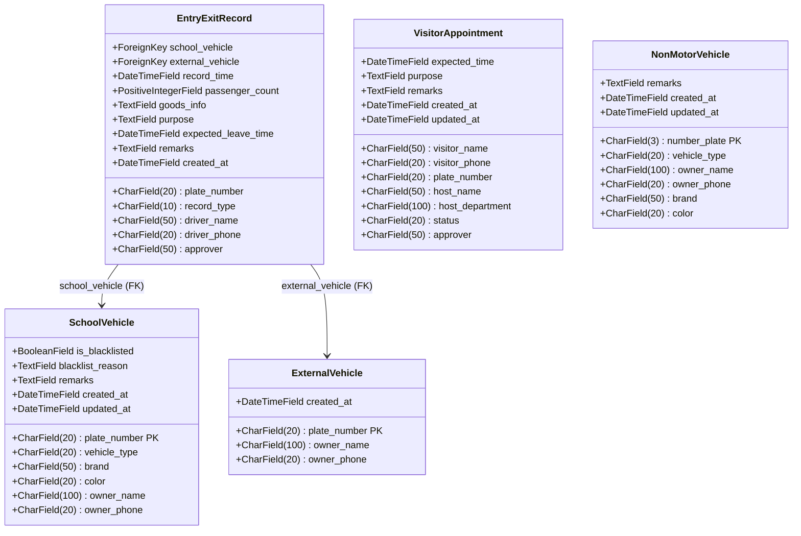

# 实体属性图 — 学校车辆进出校园登记管理系统

> 基于 `apps/vehicle_mgmt/models.py` 中 5 个 Django 模型

---

## 实体关系总览



---

## 实体属性详表

### 1. 校内车辆档案 `SchoolVehicle`

| # | 字段名 | Django 类型 | 中文名 | 约束 |
|---|--------|------------|--------|------|
| 1 | `plate_number` | `CharField(20)` | 车牌号 | **PK**, UNIQUE |
| 2 | `vehicle_type` | `CharField(20)` | 车辆类型 | choices: 校车/教职工/公务/访客/送货 |
| 3 | `brand` | `CharField(50)` | 品牌 | nullable |
| 4 | `color` | `CharField(20)` | 颜色 | nullable |
| 5 | `owner_name` | `CharField(100)` | 所属人/部门 | NOT NULL |
| 6 | `owner_phone` | `CharField(20)` | 联系电话 | nullable |
| 7 | `is_blacklisted` | `BooleanField` | 是否黑名单 | default=False |
| 8 | `blacklist_reason` | `TextField` | 拉黑原因 | nullable |
| 9 | `remarks` | `TextField` | 备注 | nullable |
| 10 | `created_at` | `DateTimeField` | 创建时间 | auto_now_add |
| 11 | `updated_at` | `DateTimeField` | 更新时间 | auto_now |

**被引用**: `EntryExitRecord.school_vehicle` (FK, SET_NULL)

---

### 2. 外来车辆档案 `ExternalVehicle`

| # | 字段名 | Django 类型 | 中文名 | 约束 |
|---|--------|------------|--------|------|
| 1 | `plate_number` | `CharField(20)` | 车牌号 | **PK**, UNIQUE |
| 2 | `owner_name` | `CharField(100)` | 所属人 | NOT NULL |
| 3 | `owner_phone` | `CharField(20)` | 联系电话 | nullable |
| 4 | `created_at` | `DateTimeField` | 首次登记时间 | auto_now_add |

**被引用**: `EntryExitRecord.external_vehicle` (FK, SET_NULL)

> 注意：该表每月月底通过管理命令 `purge_external_vehicles` 清空。

---

### 3. 进出记录 `EntryExitRecord`

| # | 字段名 | Django 类型 | 中文名 | 约束 |
|---|--------|------------|--------|------|
| 1 | `plate_number` | `CharField(20)` | 车牌号 | NOT NULL |
| 2 | `school_vehicle` | `FK(SchoolVehicle)` | 在校车辆 | nullable, SET_NULL |
| 3 | `external_vehicle` | `FK(ExternalVehicle)` | 外来车辆 | nullable, SET_NULL |
| 4 | `record_type` | `CharField(10)` | 进出类型 | choices: entry(进校)/exit(出校) |
| 5 | `record_time` | `DateTimeField` | 进出时间 | default=now |
| 6 | `driver_name` | `CharField(50)` | 驾驶员姓名 | NOT NULL |
| 7 | `driver_phone` | `CharField(20)` | 驾驶员电话 | nullable |
| 8 | `passenger_count` | `PositiveIntegerField` | 同行人数 | default=1 |
| 9 | `goods_info` | `TextField` | 货物信息 | nullable |
| 10 | `purpose` | `TextField` | 事由 | nullable |
| 11 | `expected_leave_time` | `DateTimeField` | 预计离校时间 | nullable |
| 12 | `approver` | `CharField(50)` | 审批人 | nullable |
| 13 | `remarks` | `TextField` | 备注 | nullable |
| 14 | `created_at` | `DateTimeField` | 登记时间 | auto_now_add |

**自动关联逻辑**: `save()` 中按车牌号先查 `SchoolVehicle`，命中则关联；否则自动创建/关联 `ExternalVehicle`。

---

### 4. 访客预约 `VisitorAppointment`

| # | 字段名 | Django 类型 | 中文名 | 约束 |
|---|--------|------------|--------|------|
| 1 | `visitor_name` | `CharField(50)` | 访客姓名 | NOT NULL |
| 2 | `visitor_phone` | `CharField(20)` | 访客电话 | NOT NULL |
| 3 | `plate_number` | `CharField(20)` | 车牌号 | NOT NULL |
| 4 | `host_name` | `CharField(50)` | 被访人 | NOT NULL |
| 5 | `host_department` | `CharField(100)` | 被访部门 | nullable |
| 6 | `expected_time` | `DateTimeField` | 预计进校时间 | NOT NULL |
| 7 | `purpose` | `TextField` | 事由 | NOT NULL |
| 8 | `status` | `CharField(20)` | 状态 | choices: 待审批/已通过/已拒绝/已到访/已离开 |
| 9 | `approver` | `CharField(50)` | 审批人 | nullable |
| 10 | `remarks` | `TextField` | 备注 | nullable |
| 11 | `created_at` | `DateTimeField` | 创建时间 | auto_now_add |
| 12 | `updated_at` | `DateTimeField` | 更新时间 | auto_now |

---

### 5. 非机动车档案 `NonMotorVehicle`

| # | 字段名 | Django 类型 | 中文名 | 约束 |
|---|--------|------------|--------|------|
| 1 | `number_plate` | `CharField(3)` | 编号牌 | **PK**, UNIQUE, 001~999 |
| 2 | `vehicle_type` | `CharField(20)` | 车辆类型 | choices: 自行车/电动车/三轮车/其他 |
| 3 | `owner_name` | `CharField(100)` | 所属人 | NOT NULL |
| 4 | `owner_phone` | `CharField(20)` | 联系电话 | nullable |
| 5 | `brand` | `CharField(50)` | 品牌 | nullable |
| 6 | `color` | `CharField(20)` | 颜色 | nullable |
| 7 | `remarks` | `TextField` | 备注 | nullable |
| 8 | `created_at` | `DateTimeField` | 创建时间 | auto_now_add |
| 9 | `updated_at` | `DateTimeField` | 更新时间 | auto_now |

**校验规则**: `number_plate` 必须匹配正则 `^(00[1-9]|0[1-9][0-9]|[1-9][0-9]{2})$`

---

## 外键关系矩阵

```
┌─────────────────────┐
│   SchoolVehicle     │
│  (校内车辆档案)      │
│  plate_number (PK)  │
└─────────┬───────────┘
          │ 1:N (school_vehicle, nullable)
          ▼
┌─────────────────────┐         ┌─────────────────────┐
│   EntryExitRecord   │         │   ExternalVehicle    │
│  (进出记录)          │────────▶│  (外来车辆档案)       │
│  school_vehicle FK  │ 1:N     │  plate_number (PK)  │
│  external_vehicle FK│         └─────────────────────┘
└─────────────────────┘

     ● VisitorAppointment (访客预约) — 独立实体，无 FK
     ● NonMotorVehicle (非机动车档案) — 独立实体，无 FK
```

---

## 字段统计

| 实体 | 字段总数 | PK | FK | 必填 | 可空 | 自动 |
|------|---------|-----|-----|------|------|------|
| SchoolVehicle | 11 | 1 | 0 | 5 | 4 | 2 |
| ExternalVehicle | 4 | 1 | 0 | 2 | 1 | 1 |
| EntryExitRecord | 14 | 0 | 2 | 5 | 8 | 1 |
| VisitorAppointment | 12 | 0 | 0 | 6 | 4 | 2 |
| NonMotorVehicle | 9 | 1 | 0 | 2 | 5 | 2 |
| **合计** | **50** | **3** | **2** | **20** | **22** | **8** |
